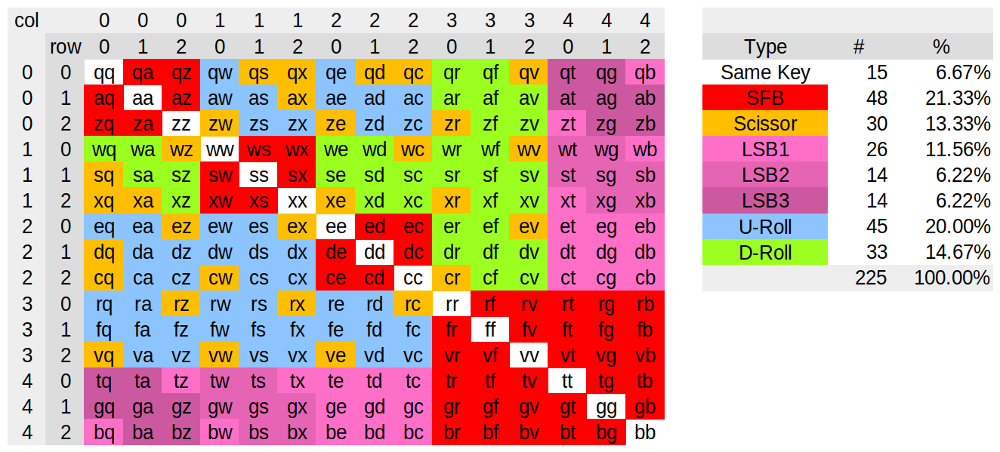

```
    Score+Con  649.6    +0.0 =  649.6 |   [Z] [F] [N] [G] [Q]| [J] [U] [O] [M][/?]  
        DRoll URoll  WLSB Scissor SFB |    1 |18 |58 |15   1 |  1  22 |60 |20 | 0   
     AB  93.4› 60.5  20.1‹  4.2   8.9 |   [C] [S] [R] [T] [D]| [Y] [I] [E] [H] [A]  
    A_B  62.4‹105.4  23.7« 12.4‹ 43.2‹|   27 |53 |50 |73  30 | 13  61 |98 |38 |65   
        RRoll Redir Contort  Runs L:R |   [W] [B] [L] [P] [V]|[.>][,<]['"] [K] [X]  
    ABC   6.2» 10.0   8.6›  1.29:1.37 |   13 |12 |33 |18   9 | 11  12 | 4 | 5 | 2   
    Travel  498.2 ( 471.8)            | 14+ 36+116+103=268 [___] 203= 89+ 83+ 27+  4
    Effort 2587.2 (2384.2)   +0.67% > | 41+ 83+141+145=411  176  413=121+162+ 63+ 67
```

# Kühlmak

_Kühlmak_ is a keyboard layout analyzer and optimizer using simulated annealing to find optimal keyboard layouts according to its analyzer stats. It allows flexible configuration of layout optimization criteria and provides versatile tools for generating and ranking optimized layouts.

The name _Kühlmak_ is a portmanteau of my last name and _Colemak_, which was the layout I was trying to beat when I started this project in 2020. My naïve goal at the time was to create "the perfect keyboard layout". After using each of QWERTZ/QWERTY, Dvorak, and Colemak for several years, I knew that learning a new layout was a huge investment, so I wanted to do as much analysis as possible before making another switch. As I went down the keyboard layout rabbit hole, I found [r/KeyboardLayouts](https://www.reddit.com/r/KeyboardLayouts) discussing many advanced keyboard layouts and analyzers that seemingly beat me to my goal. I also learned that the perfect layout is a myth because it depends on so many personal factors and preferences. Therefore the objective of this project has shifted to creating a tool that will help myself and other keyboard nerds find and choose _their_ perfect keyboard layout with confidence.

The terminology and metrics used by _Kühlmak_ for analyzing keyboard layouts are partially inspired by and partially adapted to the excellent [The Keyboard Layouts Doc (2nd edition)](https://bit.ly/layout-doc-v2). However, I made some deliberate design choices and probably introduced more subtle biases that deviate from some of those definitions.

## Features

- Command line interface
- Information-rich, text-based layout overview and stats
- Support for different types of physical keyboard layouts and fingerings (row-staggered, angle-mod, column-staggered and more)
- Extremely fast analyzer that enables simulated annealing
- Multi-threaded annealing to find many optimized layouts quickly
- Multi-objective fitness function with soft targets for individual objectives
- Multi-objective ranking system to identify the best trade-offs out of many generated layouts
- Metrics that naturally favour finger and/or hand balance for effort, travel and n-grams
- Finger travel distance weighted by speed (inspired by [Semimak](https://semilin.github.io/blog/2021/semimak.html))
- Comprehensive same-hand bigram, disjointed-bigram and same-hand 3-gram scoring system
- Support for affinity of Space to one thumb or both
- Optional constraints to enable steering certain layout features (e.g. preferred positions of punctuations and shortcuts)

## Installation

You need a Rust compiler and the Cargo package manager. Run these commands to clone the git repository, install _Kühlmak_ and check that it was installed correctly:

```
$ git clone https://github.com/fxkuehl/kuehlmak.git
[...]
$ cargo install --path kuehlmak
[...]
$ kuehlmak --version
kuehlmak 1.0
```

If you get an error "command not found", make sure that "~/.cargo/bin" is in your `$PATH` environment variable.

## A Quick Tour

_Kühlmak_ provides a command line interface with sub-commands that provide useful tools for analyzing and optimizing layouts. You can get help on the command line itself:

```
$ kuehlmak help
[...]
SUBCOMMANDS:
    anneal    Generate layouts with Simulated Annealing
    corpus    Compute corpus statistics, write JSON to stdout
    eval      Evaluate layouts
    help      Prints this message or the help of the given subcommand(s)
    init      Create workspace and initialize configuration file
    rank      Rank layouts
    stats     Print population statistics
$ kuehlmak init -h
kuehlmak-init 1.0
Create workspace and initialize configuration file

USAGE:
    kuehlmak init [FLAGS] [OPTIONS] --corpus <corpus>
[...]
```

Most of these commands require at least a workspace directory for storing layouts and a configuration file `config.toml` in that directory. `kuehlmak init` creates a new workspace with a template of a configuration file for you. The only mandatory parameter is `-C<corpus>` which specifies a text file or a JSON file containing letter, bigram and 3-gram statistics for the analyzer. To create a new workspace directory use the `-d<directory>` option. Otherwise it creates a configuration in your current directory. Then switch into the new directory so that you don't need to specify `-d<directory>` on every subsequent `kuehlmak` command.

```
$ kuehlmak init -d great_layout -C corpus/wiki.json
$ cd great_layout
```

The configuration file in `great_layout/config.toml` is initialized with all the default settings for your information so you can see all the knobs you can turn. The first ones you're likely to change are `board_type` to approximate your physical keyboard layout and preferred fingering (`Ortho`, `ColStag`, `ANSI`, `Angle`, `ISO`, `Hex`, `HexStag`) and `initial_layout` to adapt to your alphabet and special characters.

At the core of _Kühlmak_ is a very fast layout analyzer. `kuehlmak eval` lets you run that analyzer directly on existing, generated or hand-tuned layouts. Try running it on your current layout to get a feel for the stats reported by _Kühlmak_. For example:

```
$ kuehlmak eval ../layouts/colemak_dh.kbl
=== ../layouts/colemak_dh.kbl ===================
Score+Con 1998.3    +0.0 = 1998.3 |   [Q] [W] [F] [P] [B]| [J] [L] [U] [Y][;:]
    DRoll URoll  WLSB Scissor SFB |    1 |12 |18 |18  12 |  2  34 |22 |13 | 1
 AB 102.3 122.5  22.5»  3.3›  9.8›|   [A] [R] [S] [T] [G]| [M] [N] [E] [I] [O]
A_B  60.7  91.6  16.7‹  7.5  45.2 |   70 |54 |55 |72  16 | 22  61 |98 |63 |60
    RRoll Redir Contort  Runs L:R |   [Z] [X] [C] [D] [V]| [K] [H][,<][.>][/?]
ABC  20.4  34.7  23.8»  1.38:1.61 |    1 | 2 |29 |32   9 |  5  37 |10 | 9 | 0
Travel  485.5 ( 449.7)            |  4+ 20+ 62+134=220 [___] 229=146+ 52+ 31+  1
Effort 2804.7 (2484.0)   +9.03% > | 72+ 68+102+158=400  163  436=161+131+ 85+ 61
```

It outputs a compact overview of the layout, heat map, finger-travel and n-gram statistics to provide an assessment of the layout according to many relevant criteria. You could manually tweak layouts and rerun the analyzer to experiment how different changes affect the statistics and try to find your perfect layout in that way; but _Kühlmak_'s CLI is not well suited for such an interactive exploration at this time.

Or you can leave the process of tweaking and re-analyzing layouts to `kuehlmak anneal`. In that process the optimizer generates and analyzes several hundred thousand layouts that converge on one near-optimal solution in a matter of seconds to minutes. The following example generates a single layout and shows its progress as it optimizes the layout. The result is stored in the current directory. This may take a few minutes to complete:

```
$ kuehlmak anneal -p
[...]
```

Each run of the simulated annealing algorithm finds only one out of several possible solutions that all achieve relatively good scores. To find a good cross section of the best solutions, the annealing process needs to be repeated many times. How many unique solutions it can find, and how close they are to the optimum depends on the annealing schedule that can be controlled with the `-s` option. The default `-s10000` is quite slow but accurate. It's a bit like hitting "I'm feeling lucky" in a search engine, except it's 1995 again and it takes a minute or two for the page to load.

Lower values, e.g. `-s1000`, run proportionately faster and generate a wider variety of layouts. The following example generates 200 layouts with a less accurate annealing schedule using all the available CPU cores/threads. It stores the results in the current directory and prints each completed layout on the screen:

```
$ kuehlmak anneal -n200 -s1000
[...]
```

On my venerable Ryzen 2600G the above command takes less than 10 minutes. If you have more patience or a faster computer, you can use larger values for `-n`. While this command is running, you can monitor the progress in another terminal using `kuehlmak stats`. It shows some population statistics of the layouts that have been saved so far:

```
$ kuehlmak stats -s total,redirects,contorts,SFBs

Unique/total layouts found: 88/201, >253 unique layouts expected

       Score:  Popular      Min     Lower  Median Upper   Max    IQR   Range
------------------------------------------------------------------------------
       total: 1625.0×24  1622.7×5   1627.4 1641.9 1651.9 1719.7   24.5   96.9
   redirects:   14.8×24     6.8×1     14.5   14.8   16.4   23.8    1.9   17.0
    contorts:    6.2×24     3.7×1      6.3    7.1    8.4   13.5    2.1    9.8
        SFBs:   12.8×24     7.7×1      9.3   10.5   12.4   18.1    3.1   10.4
```

To help you find the most suitable layout after many annealing runs, `kuehlmak rank` provides a ranking of the results. By default it shows _all_ results ranked by their total score. This works OK with the default annealing schedule that produces a manageable number of unique layouts. If you have many unique layouts to choose from, you can limit the search to the top _N_ solutions and specify multiple criteria to find the layouts that make the best trade-offs between stats that matter to you. For example to print the top 10 layouts according to a subset of criteria use:

```
$ kuehlmak rank -n10 -s total,redirects,contorts,SFBs -p ranking
[...]
```

The `-p ranking` option causes it to save the ranked layouts to files `ranking01.kbl` ... `ranking10.kbl`. This makes it easy to file your favourite layouts away for reference or edit them for minor adjustments and run them through `kuehlmak eval` again.

If you're not satisfied with the results you're presented, there are a few things you can try:

1. Run `kuehlmak rank` with different sets of ranking criteria. Try removing less important criteria that cause undesirable compromises on the ones you really care about. Or add criteria where you see bad behaviour.
2. Run `kuehlmak anneal` for more iterations and/or lower `-s` setting to generate a wider variety of layouts. Try `-s1000 -n1000` to get a much larger variety. Then use `kuehlmak rank` with the criteria that matter to you most.
3. Change the weights of layout stats in the configuration file. Then redo the annealing and ranking steps.
4. Set targets in the configuration file to emphasize some stats while avoiding over-optimizing at the expense of other objectives. Then redo the annealing and ranking steps.
5. Use a different corpus that matches your needs better and redo the annealing and ranking steps.
6. Pick a layout that's close and tweak it manually. Run the result through `kuehlmak eval` to check for unintended consequences.

If you changed any of the settings before re-running the annealing process, either create a new workspace, or delete all the old layouts (`rm *_*.kbl`) in your existing workspace. Be careful when deleting .kbl-files, because that may include saved layouts from a ranking.

Eventually there comes the time to commit to a layout and start learning it. Before you do, I encourage you to read the rest of this README and spend some time to play with all the features of _Kühlmak_ to make the best layout for your custom keyboard.

## How to Make Your Own Corpus

To analyze keyboard layouts, you need a text corpus for your language. _Kühlmak_ currently includes two corpora for English: one generated from Wikipedia, the other from Google Books Ngram statistics for books published since 1950.

### ... from a text file

If there is no existing corpus for your language, you can create one from a (preferably large) plain text file in your language. The `kuehlmak corpus` sub-command can turn any text file into a JSON file with statistics of letter, bigram and 3-gram counts suitable for the layout analyzer.

In a pinch, you can even use the text file as corpus directly without creating a JSON file at all. If it's not hundreds of megabytes, `kuehlmak` should be reasonably quick at extracting the n-gram stats from it on-the-fly.

The `kuehlmak corpus` command has some options to limit the alphabet and prune very rare n-grams. It can read from a file with the `-i<input file>` option, or from standard input. That makes it convenient for building more sophisticated text processing pipelines to build your corpus. For an example of that, see [process_wiki.sh](https://github.com/fxkuehl/kuehlmak/blob/master/scripts/process_wiki.sh). The following stupid example creates a corpus from this README.md _(This is a terrible example, you can do way better!)_:

```
kuehlmak corpus -a"-_a-zA-Z,./;'<>?'\" " < README.md > my_corpus.json
```

Note that "-" is the first letter in the alphabet. At any other position it's used for specifying ranges like "A-Z". Also note that '\"' is escaped with a backslash to make the shell happy. Finally, Space has to be included explicitly if you want the corpus to include bigrams and 3-grams with space. This is highly recommended.

If you want the JSON file to be more human-readable, you can add the `--pretty` option.

### ... from Google Books Ngrams

Google makes the [raw data files](https://storage.googleapis.com/books/ngrams/books/datasetsv2.html) of [Google Books Ngram Viewer](https://books.google.com/ngrams/) available for download. They are available for several major languages. _Kühlmak_ includes a script `dl_gbooks.sh` to help download those files for different languages and another one, `process_bgooks.py` to turn that into a JSON file that works as a corpus for _Kühlmak_. Careful, this is a very large download, especially if you include the bigram data.

`process_gbooks.sh` can work with only 1-gram data. Bigrams make the stats of sequences including Space slightly more accurate at the cost of a much larger download. After running the script, you can optionally pass the resulting JSON file through the `kuehlmak corpus` command to trim the alphabet.

Example for making a German corpus from Google Books 1-gram data with books published since 1970. It uses [PyPy](https://pypy.org/), a JIT-compiling Python implementation, which is a lot faster than the normal Python interpreter:

```
$ cd corpus
$ mkdir gbooks_ger
$ cd gbooks_ger
$ ../../scripts/dl_gbooks.sh ger
googlebooks-ger-all 100%[===================>]   8.99M  7.40MB/s    in 1.2s    
-ger-all-1gram-2012  50%[=========>          ]  30.51M  7.39MB/s    ETA 4s     
...
Skipping bigrams. Use the option '-2' to enable bigram download.
$ zcat googlebooks-ger-all-1gram-20120701-* \
  | pypy3 ../../scripts/process_gbooks.py 1970 > gbooks_ger_tmp.json
Processed 133M records: Zauberlehrlingen                        
Approximating word bigrams ...
$ kuehlmak corpus -a"-_a-zäöüßA-ZÄÖÜ,./;'<>?\!'\" " -i gbooks_ger_tmp.json > ../gbooks_ger.json
```

This example downloads about 3.1GB of data. The processing step takes about 10 minutes on my computer.

## Configuration

### Layout Types

_Kühlmak_ supports multiple physical layouts. The choice of layout influences the per-key costs, finger travel distances and in some cases the fingering. The key map output also visualizes the layouts differently.

The default setting is `board_type = Ortho` for ortholinear layouts. This is also a good choice for making layouts that will work reasonably well on any type of keyboard with standard fingering. The other types will optimize more towards a specific type of keyboard.

For row-staggered keyboards use `ANSI`, `Angle` or `ISO`. `ANSI` is for the standard fingering on ANSI keyboards. `Angle` uses an angle mod for left bottom row. This results in the left pinky not having a left bottom key. Instead the index finger has a 7th key in the middle. ISO keyboards have one more key on the bottom-left corner. This is used to create an angle-mod without removing the left bottom pinky key.

For strongly column-staggered layouts use `ColStag`. Compared to `Ortho` this removes the preference for the top row on middle and ring fingers and the bottom row for index fingers and pinkies. This may allow the optimizer to reduce the number of scissor bigrams in generated layouts.

The two remaining board types are `Hex` and `HexStag`. I created these for my [Mantis](https://github.com/fxkuehl/mantis) keyboard with hexagonal keys, which has 5 keys on the index fingers and 4 keys on the pinkies. `Hex` is more like a symmetrical row-stagger, which prefers the upper row on middle and ring fingers and the lower row on index fingers and pinkies. `HexStag` accounts for the column-stagger and mostly removes that preference.

### Affinity of Space

On split keyboards with Space only on one side, the hand with Space has a significantly higher load. With an average word length of 5 letters, 17% of all keystrokes are Space. Furthermore, without an option to use Space on the alternate hand, the thumb will get involved in more rolls, redirects and contortions. _Kühlmak_ takes that into account when `space_thumb = "L"` or `space_thumb = "R"` is set in the configuration file.

On the other hand, with `space_thumb = "Any"` (the default) the Thumb does not contribute to load imbalance and does not get involved in rolls, redirects or contortions. Instead, Space breaks up any same-hand sequence on either hand into a disjointed bigram. These are simplifying assumptions, which depend on the typist alternating thumbs appropriately.

If you alternate thumbs on Space or you feel that your thumbs operate more or less independently of the other fingers, then `space_thumb = "Any"` probably works best for you. The following examples show Colemak-DH on an ortho-linear layout with different Space affinities for comparison. Note how the Roll, Redir, Contort and Imbalance stats change:

```
Score+Con 1998.3    +0.0 = 1998.3 |   [Q] [W] [F] [P] [B]| [J] [L] [U] [Y][;:]
    DRoll URoll  WLSB Scissor SFB |    1 |12 |18 |18  12 |  2  34 |22 |13 | 1
 AB 102.3 122.5  22.5»  3.3›  9.8›|   [A] [R] [S] [T] [G]| [M] [N] [E] [I] [O]
A_B  60.7  91.6  16.7‹  7.5  45.2 |   70 |54 |55 |72  16 | 22  61 |98 |63 |60
    RRoll Redir Contort  Runs L:R |   [Z] [X] [C] [D] [V]| [K] [H][,<][.>][/?]
ABC  20.4  34.7  23.8»  1.38:1.61 |    1 | 2 |29 |32   9 |  5  37 |10 | 9 | 0
Travel  485.5 ( 449.7)            |  4+ 20+ 62+134=220 [___] 229=146+ 52+ 31+  1
Effort 2804.7 (2484.0)   +9.03% > | 72+ 68+102+158=400  163  436=161+131+ 85+ 61
```
_space_thumb = "Any"_

```
Score+Con 2349.5    +0.0 = 2349.5 |   [Q] [W] [F] [P] [B]| [J] [L] [U] [Y][;:]
    DRoll URoll  WLSB Scissor SFB |    1 |12 |18 |18  12 |  2  34 |22 |13 | 1
 AB 173.5‹227.9‹ 22.5»  3.3›  9.8›|   [A] [R] [S] [T] [G]| [M] [N] [E] [I] [O]
A_B  90.2‹ 98.4  13.8   5.6› 34.3 |   70 |54 |55 |72  16 | 22  61 |98 |63 |60
    RRoll Redir Contort  Runs L:R |   [Z] [X] [C] [D] [V]| [K] [H][,<][.>][/?]
ABC  49.5« 85.0« 36.6   2.04:1.61 |    1 | 2 |29 |32   9 |  5  37 |10 | 9 | 0
Travel  485.5 ( 449.7)            |  4+ 20+ 62+134=220[___]  229=146+ 52+ 31+  1
Effort 2804.7 (2484.0)  +29.14% < | 72+ 68+102+158=400 +163  436=161+131+ 85+ 61
```
_space_thumb = "L"_

```
Score+Con 2404.9    +0.0 = 2404.9 |   [Q] [W] [F] [P] [B]| [J] [L] [U] [Y][;:]
    DRoll URoll  WLSB Scissor SFB |    1 |12 |18 |18  12 |  2  34 |22 |13 | 1
 AB 189.8»172.7› 22.5»  3.3›  9.8›|   [A] [R] [S] [T] [G]| [M] [N] [E] [I] [O]
A_B 105.2›155.7› 13.8«  6.3‹ 40.2‹|   70 |54 |55 |72  16 | 22  61 |98 |63 |60
    RRoll Redir Contort  Runs L:R |   [Z] [X] [C] [D] [V]| [K] [H][,<][.>][/?]
ABC  47.3» 93.0» 29.9»  1.38:2.02 |    1 | 2 |29 |32   9 |  5  37 |10 | 9 | 0
Travel  485.5 ( 449.7)            |  4+ 20+ 62+134=220  [___]229=146+ 52+ 31+  1
Effort 2804.7 (2484.0)  +49.83% > | 72+ 68+102+158=400  163+ 436=161+131+ 85+ 61
```
_space_thumb = "R"_

### Weights and Targets

The layout analyzer produces many statistics that try to predict the subjective typing experience when using a layout. E.g a layout with many SFBs (same finger bigrams) may slow down your typing flow. High WLSBs indicate lots of lateral stretching. High effort may be caused by overusing some fingers, or having frequent keys off the home row. Etc.

The simulated annealing algorithm has to take all these different stats and turn them into a single score that it tries to minimize. To do this, it needs to assign a weight to each of the statistics that determines how much a change in that stat affects the overall score. You can configure these weights in the `[weights]` section in the configuration file. Any stat with a positive weight will be minimized by the optimizer. Stats with negative weights will be maximized.

The optimizer can trade different stats against each other. E.g. if SFBs have a weight of 5 and WLSBs have a weight of 1, it means a layout can compensate 1 more SFB with 5 less WLSBs and get the same score. Tuning these weights to get the desired results is not straight-forward. The defaults built into the program should give mostly sensible results that try to find a compromise between most stats. However, you'll still see many different solutions with different trade-offs between different scores, and they may not be what you had in mind.

Therefore _Kühlmak_ also lets you specify a target value for each of the stats. These are soft targets. The weight of a stat gets boosted by a configurable factor above the target value and reduced below the target. This increases the incentive to optimize towards the target values but reduces the reward for optimizing beyond it.

For stats with negative weight, the effect will be reversed to provide the correct incentives: The weight is reduced for larger values and boosted for smaller values.

The `factor` is a global parameter that determines the strength of the weight-boosting effect for all scores with targets in the same way. A factor of 1 means there is no effect. A factor greater than 1 optimizes towards the target; a factor between 0 and 1 optimizes away from the target (probably not useful). A factor of zero or less is illegal and disables targets. The target values are separate parameters for each stat. Scores without a target are unaffected.

Try setting target values for the scores that you care most about. Let the other stats sort themselves out with their weights alone. If you want to force the optimizer to get closer to the targets, try increasing the `factor`. Values between 1 and 5 may be sensible, 3 is a good starting point. An example that works well for me:

```
[targets]
factor = 3.0
effort = 2500
travel = 500
drolls = 100.0
urolls = 60.0
WLSBs = 20.0
scissors = 3.0
SFBs = 8.0
redirects = 12.0
contorts = 8.0
```

### Constraints

Constraints are additional penalties for arbitrary features of the layout that are not part of the fitness function. They can be used to force the layout to adopt certain features. The Constraints score can also be included as a criteria in the ranking.

#### ZXCV in the Left Bottom Row

```
[constraints]
zxcv = 0.1
```

This constraint imposes penalties for putting ZXCV outside the left bottom row or in the wrong order.

#### Punctuation Characters in the Colemak Locations

```
[constraints]
nonalpha = 0.1
```

This constraint imposes penalties for putting non-alpha keys on positions other than where Colemak places them.

#### Similarity With a Reference Layout

```
[constraints]
ref_layout = '''
  q  w  e  r  t  y  u  i  o  p
  a  s  d  f  g  h  j  k  l ;:
  z  x  c  v  b  n  m ,< .> /?
'''
ref_weight = 0.5
ref_threshold = 0.2
```

The reference layout can be given in the configuration file, or you can set `ref_layout` to a filename that contains the reference layout. `ref_threshold` is a value between 0 and 1 that determines how different the actual layout can be without incurring any penalty. `ref_weight` determines how heavily this constraint punishes deviations from the reference layout beyond the threshold. A smaller weight allows the optimizer to trade good layout choices more liberally against deviations from the reference layout.

#### Availability of Homing Keys

```
[constraints]
homing_keys = "fjhunt"
#homing_only_keys = "fj"
homing_weight = 0.3
```

This constraint is useful for creating layouts using uniform keycap sets, but placing homing keys in useful locations. Given the available homing keys, it will try to place two of those keys symmetrically on the left and right hand home row, either on the index or middle fingers. If `homing_only_keys` are given, there is a penalty for placing those keys improperly.

#### Availability of Row-Specific Keys

```
[constraints]
top_keys = "qwertyuiopfgjlcdbk',.;/"
top_weight = 1
mid_keys = "asdfghjkl;truenoiym-"
mid_weight = 1
bot_keys = "zxcvbnm,./qwjkdlph';"
bot_weight = 1
```

These constraints specify the availability of keys in each row of the keyboard. This can be used to create layouts that can be implemented with sculpted keycap sets, e.g. with Colevrak sets. A weight of 1 for each of these should ensure that the generated layouts obey the constraints.

## Understanding the Analyzer Stats

Lets look at an example of the output produced by the analyzer command `kuehlmak eval layouts/qwerty.kbl layouts/colemak_dh.kbl`:

```
=== layouts/qwerty.kbl ===================
Score+Con 4270.2    +0.0 = 4270.2 |   [Q] [W] [E] [R] [T]| [Y] [U] [I] [O] [P]
    DRoll URoll  WLSB Scissor SFB |    1 |12 |98 |54  72 | 13  22 |63 |60 |18
 AB  52.1‹ 95.6« 78.7  25.2  49.5‹|   [A] [S] [D] [F] [G]| [H] [J] [K] [L][;:]
A_B  27.6‹ 61.9« 63.8‹  9.9  45.0‹|   70 |55 |32 |18  16 | 37   2 | 5 |34 | 1
    RRoll Redir Contort  Runs L:R |   [Z] [X] [C] [V] [B]| [N] [M][,<][.>][/?]
ABC  14.6« 31.8‹ 59.1‹  1.70:1.49 |    1 | 2 |29 | 9  12 | 61  22 |10 | 9 | 0
Travel 1095.5 (1004.9)            |  4+ 21+245+287=557 [___] 448=260+ 78+ 93+ 17
Effort 5031.6 (3948.9)  +35.24% < | 72+ 69+159+181=481  163  356=156+ 78+103+ 19
=== layouts/colemak_dh.kbl ===================
Score+Con 1998.3    +0.0 = 1998.3 |   [Q] [W] [F] [P] [B]| [J] [L] [U] [Y][;:]
    DRoll URoll  WLSB Scissor SFB |    1 |12 |18 |18  12 |  2  34 |22 |13 | 1
 AB 102.3 122.5  22.5»  3.3›  9.8›|   [A] [R] [S] [T] [G]| [M] [N] [E] [I] [O]
A_B  60.7  91.6  16.7‹  7.5  45.2 |   70 |54 |55 |72  16 | 22  61 |98 |63 |60
    RRoll Redir Contort  Runs L:R |   [Z] [X] [C] [D] [V]| [K] [H][,<][.>][/?]
ABC  20.4  34.7  23.8»  1.38:1.61 |    1 | 2 |29 |32   9 |  5  37 |10 | 9 | 0
Travel  485.5 ( 449.7)            |  4+ 20+ 62+134=220 [___] 229=146+ 52+ 31+  1
Effort 2804.7 (2484.0)   +9.03% > | 72+ 68+102+158=400  163  436=161+131+ 85+ 61
```

There is a lot of useful information to unpack. For each layout, the left half shows all the stats included in the total score. The key map and heat map are shown on the right with per-finger and per-hand usage and travel information below the key map. Most of the numbers are normalized per 1000 keystrokes.

At the top left there is a total score that is what `kuehlmak anneal` will try to minimize. The second number is based on constraints set in the configuration file. Below that you find the detailed metrics that summarize the strengths and weaknesses of each layout.

The "AB" row shows stats for same-hand bigrams. "A_B" shows the corresponding stats for skip-grams that alternate hands. The "ABC" row shows stats for different types of same-hand 3-grams.

All the n-gram scores have a balance indicator. If the indicator is missing, it means that this type of n-gram is approximately evenly distributed between the left and right hand (no worse than 60:40). A single arrow shows an imbalance larger than 60:40 towards the indicated side. A double arrow flags an imbalance worse than 75:25.

"Runs L:R" is an estimate of the average length of same-hand key sequences based on the same-hand bigram counts for each hand. Higher numbers can be a sign of more pin-balling. This is purely informational and not used directly in the optimization.

The "Travel" row shows the total travel score, raw travel score in parentheses as well as per-finger and per-hand travel under the key map. The raw travel score is simply the sum of all per-finger travel scores. The final travel score for the optimization uses the root of a weighted sum of squares, which penalizes imbalance between fingers while taking into account different finger strengths.

The "Effort" row is based on the heat map weighted with per-key cost values that favour strong fingers and keys on the home row. The raw score in parentheses is the sum of all per-finger costs. The final score for the optimization uses the root of the sum of squares that penalizes imbalance (i.e. overuse of particular fingers). The third number is a simple hand imbalance percentage based on numbers of keystrokes with an arrow pointing to the more heavily used hand. "X% <" means the left hand has X% more keystrokes than the right. Per-finger and per-hand usage is shown below the key map with the thumb (space) key shown in the middle. They should add up to a total of 1000 keystrokes (or slightly off due to rounding).

The example above shows the weaknesses of QWERTY quite clearly: high SFBs, scissors and lateral stretches, lots of contortions and a strong imbalance toward the left hand. The heat map shows many frequent keys off the home row. This is also reflected in much higher effort and travel scores compared to Colemak-DH.

Colemak-DH is much better in almost every metric. However, compared to more modern layouts, it still has high redirects and contortions. It also tends to have more rolls and fewer hand alternations, leading to pin-balling. Looking at the heat map and per-finger stats, index fingers on Colemak-DH are overused in my opinion and also have excessive travel.

If you want even more information, add a `-v` option to the `kuehlmak eval` command. That will print detailed stats for individual n-grams by category. For example it can quickly answer questions like "What are the most frequent SFBs on the left hand in Colemak-DH?":

```
[...]
SFBs:
 Left hand: sc:1.08 pt:0.68 cs:0.24 wr:0.23 za:0.22 az:0.15 dg:0.15 gt:0.12 [...]
Right hand: e,:1.15 ue:1.02 y.:0.57 nl:0.38 eu:0.37 nk:0.30 kn:0.27 lm:0.26 [...]
Balance: 3.81:5.95
[...]
```

### N-gram Definitions and Scoring

_Kühlmak_ has a comprehensive scoring system for same-hand bigrams, alternates and same-hand 3-grams. It categorizes and scores all same-hand bigrams and alternates, and most same-hand 3-grams. The configuration file can specify a weight for each category.

For bigrams, hand change is not categorized and gets an implicit score of 0. Same-key bigrams are also not counted because their number doesn't depend on any layout choices. All other same-hand bigrams are counted and scored. The weights determine how good or bad a bigram is considered relative to hand alternation. The following picture shows the complete same-hand bigram classification as a 15x15 matrix labeled with the QWERTY sequences for reference:


_Same-hand bigram classification system_

Alternates are like same-hand bigrams, interrupted by a keystroke on the other hand or space. The movement of the hand that hits the first and last key is exactly the same as a same-hand bigram, except it is somewhat slower. Low-redirect layouts rely heavily on hand alternation. Therefore, _Kühlmak_ categorizes and scores them as disjointed bigrams (with a d-prefix) equivalent to their same-hand counterparts. This includes the notion of disjointed rolls, which may be a new concept in keyboard layout analyzers.

#### SFBs

Same-finger bigrams, excluding repeats of the same key (e.g. "ed" on QWERTY). This forces the same finger to be used repeatedly and travel quickly between keys, which should be avoided as much as possible.

#### Scissors

Scissors are uncomfortable jumps between fingers across rows (e.g. "ex").

#### WLSBs

Weighted lateral stretch bigrams, weighted by the inverse of the finger distance. Stretches between neighbouring fingers (i.e. middle to index finger) or stretches that are also scissors are fully counted as LSBs (e.g. "be"). Stretches between distant fingers partially count as stretches and URolls except if they're also scissors. E.g. a stretch from pinky to index finger counts as 1/3 stretch and 2/3 URoll (e.g. "at").

#### Down and Up-Rolls

DRolls and URolls are remaining same-hand bigrams that roll easily and comfortably, where D (down) is slightly better than U (up). The terms "up" and "down" are metaphorical. Some people prefer in-rolls over out-rolls. _Kühlmak_ modifies this classification for rolls involving the ring finger to account for how the ring finger is not able to move independently of its neighbours. That makes it easier to roll away from the ring finger and harder to roll towards it or skip over the ring finger from its direct neighbours.

#### RRRolls

Moving on to 3-grams: RRolls are three keystrokes rolling comfortably in the same direction, either in or out (e.g. "few").

#### Redirects

Abbreviated as "Redir" in the layout overview. These are rolls that change direction (e.g. "sar"). This is considered difficult to coordinate by many users. It can also contribute to pin-balling where the same hand types long sequences of letters, causing strain.

#### Contortions

These are uncomfortable sequences of three same-hand keys. This includes chains of two bad bigrams (SFBs, scissor or lateral stretches, e.g. "kno"), disjointed Scissors or dSFBs with another key on the same hand between them (e.g. "car", "far"), as well as same-finger 3-grams (e.g. "num", "nny").

The Keyboard Layout Document defines a Roll as a same-hand bigram using two different fingers followed by a hand-change. This definition requires 3-grams. _Kühlmak_'s DRoll and URoll definitions are based on simple bigrams. Instead it relies on the scores for same-hand 3-grams to adjust its bigram-based Roll scores for things that the 3-gram-based definition would not consider a Roll.

The bigram-based definition makes Rolls part of a comprehensive same-hand bigram scoring system that classifies _all_ same-hand bigrams consistently.

## Nerdy Details

This section goes into some excessive details of the scoring and ranking functions that you don't need to know to use _Kühlmak_ effectively.

### Promoting Finger and Hand Balance

The effort model consists of several components based on per-key cost and per-finger travel. The key costs are added up per finger. To penalize imbalance, the weighted per-finger cost or travel values are squared before summing them up and taking the square root. If the finger usage is unbalanced, the result will be dominated by the most over-used fingers and can be almost three times worse than a perfectly balanced layout.

The results are normalized so that a balanced layout will have the same score as the raw sum of the per-finger cost or travel. A larger discrepancy between the raw and final scores indicates a larger imbalance.

Similarly all the n-gram scores are the root of the sum of squares of per-hand counts, normalized to match the raw sum for balanced stats. By default the compact layout stats show the raw n-gram counts. Use the `--show-scores` option to see the real n-gram scores as well as the cost-weighted key usage in the heat map.

### Estimating Travel Distance from N-grams

Finger travel distance is estimated from n-gram data. An individual keystroke could be considered to require travelling from the finger's home position to the key position. In practice, fingers don't always return to the home position before the next key stroke, though. In an SFB the finger travels directly between two keys without returning to the home position. This applies similarly to dSFBs, except the finger moves a bit slower.

The starting point for the estimate is the letter frequency data and the distance of each key from the home position. The return to the home position is not counted because that is just the result of relaxing the finger. This estimate can be corrected with same-finger bigrams and skipgrams by subtracting the travel distance from home to the last key and adding the distance from the first to the last key.

The distance is weighted more heavily for dSFBs (×2) and SFBs (×4) to account for the added speed required.

### Multi-Objective Ranking System

Every annealing run starts with a randomly scrambled layout and uses a different random seed. With a faster annealing schedule the optimizer generates many different layouts in a short time that all have relatively good scores according to the multi-objective fitness function. Different layouts make different trade-offs between those objectives. A good overall layout balances several of these objectives. But without a-priori knowledge of the fitness landscape it is very difficult to know what makes a good trade-off. Furthermore, some objectives may be considered more important depending on the user's preferences.

The ranking system tackles these problems by using population statistics of all the generated layouts as a gauge for the range and sensitivity of scores for each individual objective. It ranks all the layouts by each individual objective and sums up multiple per-objective ranks to arrive at an overall ranking.

Layouts that sacrifice some objectives disproportionately end up with a worse overall rank. What constitutes a disproportionate sacrifice or a poor trade is based on the per-objective ranking of the layout within the entire population. This eliminates the need to configure or hard-code per-objective weights and biases. Typically the best overall layouts are among the top five or ten layouts out of hundreds.
